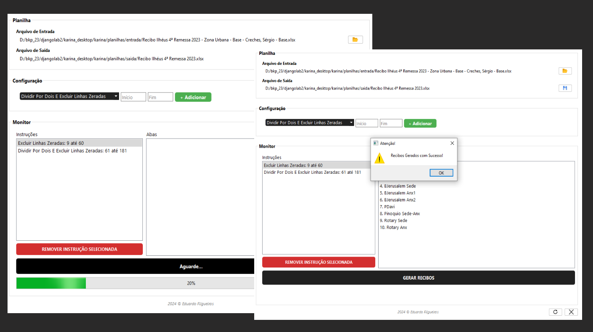

<h1 align="left">Gerador de Recibos</h1>

<h2>Tecnologias</h2>
Esse projeto foi desenvolvido com as seguintes tecnologias:  
<ul>
    <li>Python</li>
    <li>PyQt6</li>
</ul>
<h2>Projeto</h2>

Desenvolvimento de uma Aplicação que gera recibos de entrega a partir de uma planilha padrão de solicitação de produtos. 

O sistema seleciona, a partir do "range" de linhas definido pelo usuário, as operações que precisam ser realizadas para cada aba da planilha: exclusão de linhas, exclusão de linhas com produtos zerados, e divisão ou multiplicação da quantidade dos produtos. Ao final, uma nova planilha é gerada, ficando somente as informações de produtos necessários ao recibo. 

Projeto pessoal que foi aproveitado em ambiente de trabalho.

